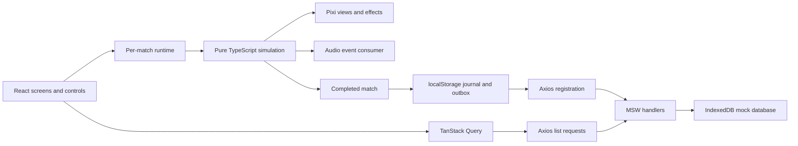

# Pirate Battle architecture

This document describes the current implementation. Operational commands and reproducible failure scenarios are in [README.md](README.md). Performance measurements belong in [PERFORMANCE.md](PERFORMANCE.md); targets and resource counters are not substitutes for measured evidence.

## Boundaries and ownership

The application separates the simulation, its presentation and its record-submission flow. Gameplay does not wait for an API response. React does not own per-frame entity positions, and the renderer does not determine damage or score.

| Area | Main files | Responsibility |
| --- | --- | --- |
| Application shell | `src/main.tsx`, `src/app/App.tsx`, `src/app/GameScreen.tsx` | Providers, screens, stable sessions, loading, HUD snapshots and result transitions. |
| Simulation | `src/game/` | World state, clock, movement, weapons, enemies, navigation, collisions and completion. |
| Rendering | `src/rendering/` | Asset loading, Pixi application, camera, scenery, entity views and transient effects. |
| DOM interface | `src/screens/`, `src/components/` | Menus, accessible controls, native dialogs, record tables and feedback. |
| Audio | `src/audio/` | Shared Web Audio engine, gesture unlock, cached buffers, ambience and event-driven sound cues. |
| Data client | `src/data/` | Contracts, validation, Axios requests, TanStack Query hooks, local journal and outbox. |
| Submission lifecycle | `src/app/SubmissionProvider.tsx`, `src/app/dataService.ts` | Startup, pending-record recovery and coordinated resets. |
| Mock service | `src/mocks/` | MSW handlers, injected request behavior, IndexedDB and seeded fixtures. |
| Verification | `src/testing/`, `tests/`, `playwright*.ts` | Deterministic scenes, test bridge, browser tests, visual checks and audio unit tests. |



MSW intercepts browser requests; its handlers execute the local mock behavior. The IndexedDB database is the demonstration's confirmed-record store, not a remote service. Separate browsers and origins do not share data.

## React and PixiJS integration

`main.tsx` mounts React Strict Mode, a shared `QueryClientProvider`, and an app-level `SubmissionProvider`. It starts the data service independently of the game renderer. `App` owns the selected screen, current session, result and optional performance report. It also owns the application audio subscription through an effect.

Pressing Play creates a `GameSession` in `src/game/session.ts`:

1. Generate one `matchId` with `crypto.randomUUID()`.
2. Load the stable local player identity.
3. Clone `DEFAULT_CONFIG`, apply saved session/spawn settings, and recursively freeze the resulting configuration.
4. Include a test setup only in an explicit E2E build.

`GameScreen` mounts a `GameAttempt` keyed by match ID and retry number. Its effect waits for the shared required-assets promise, computes the configuration comparison key, and creates the runtime. A loading failure is shown in React with Retry and Main Menu. Retry remounts the attempt; it does not consume session time.

PixiJS 8 initializes asynchronously with `await app.init(...)`. Initialization happens before the canvas is attached. The application uses WebGL preference, `autoStart: false`, a non-shared ticker, automatic density and a renderer resolution capped at DPR 2. The runtime owns a separate private `Ticker` and explicitly calls `app.render()` after updating the views.

`mountAsyncRuntime` handles React Strict Mode's setup/cleanup cycle and navigation during asynchronous initialization. Cleanup marks the attempt canceled. If acquisition resolves later, the returned runtime is destroyed instead of started. An active runtime attaches the canvas and binds input only in `start()`. The factories also clean up partial initialization when an exception occurs.

Stable session and callback identities prevent ordinary HUD updates from recreating the runtime. The runtime publishes a new React HUD snapshot only when HP, maximum HP, score, rounded remaining seconds or phase changes. Entity positions stay in the simulation and Pixi scene.

## Simulation lifecycle and clock

The world phases are `running`, `paused`, `ended` and `abandoned`.

- **Running:** accept gameplay input and advance systems.
- **Paused:** stop advancing simulation time, clear held controls and reset clock accumulation. Rendering may continue, but effects based on active time remain frozen.
- **Ended:** a guarded `finish()` captures a result once, after time expiry or player death.
- **Abandoned:** navigating away or destroying a live runtime stops the session without producing a completed-match record.

The simulation is created after renderer initialization succeeds. Its clock is first reset and started when the runtime starts. Loading therefore consumes no active match time.

`src/game/clock.ts` accumulates elapsed `performance.now()` time and calls `step(1 / 60)` for each complete fixed interval. The simulation caps the last step at the exact remaining session duration. Cooldowns, spawning, AI and projectiles all use active simulation seconds.

Pause/resume resets the clock baseline, so time spent paused or hidden is not caught up. Window blur and hidden-document visibility pause explicitly. Resume requires a visible, focused page and restores arena focus. Page hide destroys the match runtime.

**Current tradeoff:** there is no maximum accumulated delta or step-count cap for a long foreground stall. This preserves elapsed active time but can produce a costly catch-up loop. Any future catch-up limit should specify whether elapsed time is dropped or accounted for separately; changing this silently changes match semantics.

Each step advances active time, reduces weapon cooldowns, and runs these systems in order:

1. Snapshot all held input actions.
2. Attempt scheduled enemy spawns.
3. Turn and move the player.
4. Steer enemies using their cached paths.
5. Fire held player weapons and eligible Shooters.
6. Advance projectiles and resolve their first collision.
7. Resolve Chaser contact damage.
8. Remove dead entities and finish on zero HP or session expiry if still running.

Damage may finish the simulation during a system, preventing later systems from running. If lethal damage occurs in the final time step, that death is recorded before the final time-expiry check. The completion callback is buffered by the runtime until its render/event-delivery pass; React then receives the result.

The world is plain TypeScript data. A seeded PRNG drives spawning; entity IDs increase within each runtime. Visual debris does not consume the gameplay PRNG. Given the same configuration, fixed-step input sequence and test setup, gameplay is reproducible; UUIDs and real completion timestamps are deliberately outside that deterministic sequence.

## Movement, spawning and navigation

Logical coordinates use +x to the right and +y downward. Heading zero points right. Forward movement uses `(cos(angle), sin(angle))`. Movement speed is units per second; angular speed is radians per second.

`moveShip` subdivides travel into distances no larger than half the ship radius. It clamps each axis inside the arena and tests circle-versus-island overlap before accepting the x and then y displacement. This permits sliding along an island edge. Movement does not implement general ship-to-ship physical separation.

Enemy spawn positions lie on an inset arena perimeter. A candidate must respect the arena, island clearance, minimum player distance and other living enemies. The algorithm tries a bounded number of seeded random samples, then a finite evenly spaced perimeter scan. If no point is safe, it skips that scheduled spawn. The next spawn time still advances, but the Chaser/Shooter sequence index advances only after a successful spawn. There is no hard living-enemy cap.

`src/game/aiNavigation.ts` uses a visibility graph, not a tile grid. It expands each island by ship radius plus navigation clearance, builds nodes around obstacle corners, rejects segments through obstacles, and finds a shortest path using a Dijkstra-style search. A point inside the expanded clearance area is moved to a nearby usable start/goal candidate where possible.

The runtime owns a `Map<enemyId, NavigationState>`. Paths are replanned after the configured time or player displacement; dead-enemy entries are discarded. Enemies turn toward the next waypoint and move only within their heading tolerance. Chasers continue toward the player. Shooters stop advancing only when inside `stopDistance` with a clear shot, then turn toward the player. Firing additionally requires attack range, aim tolerance, line of sight and an available cooldown.

## Weapons, collision and scoring

`tryFire` checks phase, life, kind and the requested weapon-slot cooldown. Player front/left/right slots are independent; Shooters use front only and Chasers cannot fire.

- A front shot starts beyond the ship radius along its heading.
- Each broadside creates three muzzle positions spaced along the hull. Their base direction is perpendicular to the ship.
- `player.broadsideOuterAngle` is in **degrees** and converts to radians inside `weapons.ts`. The middle shot uses zero spread; the forward and rear shots fan toward their respective ends. The default of zero gives three parallel shots.
- The segment from ship center to muzzle is checked against expanded islands. An obstructed muzzle does not create a projectile, although the accepted volley still consumes its cooldown and emits firing feedback.

Projectiles store their faction, direction, speed, damage, radius, age, distance, range and lifetime. Each step truncates travel to the earliest of elapsed travel, lifetime, range or arena boundary. The collision code sweeps that segment rather than testing only the final point:

| Interaction | Model and outcome |
| --- | --- |
| Projectile / island | Segment against an axis-aligned rectangle expanded by projectile radius; the projectile is consumed. |
| Projectile / ship | Segment against a circle with combined ship/projectile radii; the first target takes damage once. |
| Chaser / player | Circle contact; the Chaser is destroyed and the player takes ram damage once. |
| Ship / island or arena | Movement is blocked/clamped; no collision damage. |

Only opposing factions are projectile targets. Islands are considered before ships; an exact collision-time tie stays with the island. Ship candidates are ordered by ID for consistent equal-time selection. Expired or consumed projectiles cannot damage another target.

`damageShip` clamps HP to zero, emits damage feedback and guards already-dead targets. Killing an enemy with a player weapon awards **one point**, regardless of enemy kind. A Chaser that destroys itself by ramming awards no point. Player death ends the match immediately.

These are deliberately simple collision models. Expanded rectangles are conservative near corners, ship circles do not match the exact hull outline, and projectiles sweep against the target position for that step rather than a continuously moving target volume.

## Rendering, input and resources

The renderer owns a world container with scenery, ship views, projectile trails/sprites and an effects layer. Maps keyed by entity ID create a view only for a new entity; absent/dead entities destroy their view. Projectiles use reusable shared textures but individual sprite instances. Effects expire by active simulation time, with a maximum of 128 live effects.

The camera follows the player with 32 logical units of look-ahead. Scale is based on the viewport fit multiplied by 1.75, with a minimum view scale derived from the shorter viewport dimension. It presents a closer view and may show only part of the 960 × 540 world. Resizing changes camera/renderer dimensions, not simulation coordinates or collision bounds. `ResizeObserver` and a window resize listener keep it current.

The central island uses the supplied 4 × 4 tile arrangement from `ISLAND_TILE_GRID`, with the appropriate shore edges and grassy interior. Ship artwork switches at 65% and 30% HP, flashes for 0.12 active seconds after damage, and shows animated fire at or below 30%. The hull rotation is `ship.angle - Math.PI / 2` to align the downward-facing artwork with the simulation heading. Health bars are sibling views outside the rotated hull: green for the player and red for enemies. Decorative effects have no gameplay collision.

Keyboard and touch input feed the same action controller. A set of source IDs per action prevents one released pointer/key from canceling another that still holds the action. The controller supports simultaneous movement and firing. Keyboard presses are accepted only while the arena is focused and the world is running. Blur, pause and disposal clear all held actions. Native dialogs and HTML controls handle focus and navigation outside the canvas.

`loadGameAssets` preloads the renderer and gameplay HUD artwork through one shared promise and broadcasts progress to current listeners. Pixi's Assets cache retains successful loads. On rejection, the wrapper clears the pending promise and progress so Retry can attempt acquisition again. Test mode can replace one URL on the first attempt to exercise failure even with other resources cached. Audio is loaded separately and is optional.

Resource ownership is explicit:

| Owner | Acquires | Releases |
| --- | --- | --- |
| Application asset cache | Shared textures and a shared load promise | Retained across matches; no explicit app-level texture-unload API currently exists. Page teardown releases the application. |
| Match runtime | Simulation, clock, private ticker, input/event/path state, gameplay listeners, battle audio scope | Stops/removes/destroys ticker; removes listeners; clears state; abandons/releases simulation; destroys renderer and battle scope. |
| Renderer | Pixi application/canvas, scene graph, resize observer/listener, entity views and effects | Disconnects observer/listener, destroys views/application and removes canvas. |
| React attempt | Pending runtime acquisition and callbacks | Marks cancellation and destroys an acquired or late-arriving runtime. |
| Application audio owner | Gesture/UI/visibility subscriptions and shared audio engine | Removes subscriptions and disposes audio resources when its final owner is released. |

Per-match sprite/application destruction explicitly preserves shared `texture` and `textureSource` resources. All match `destroy()` paths are idempotent. The runtime releases its simulation reference, clears events and navigation, and removes test hooks on exit. A warm texture/audio cache after returning to Menu is expected; retained match canvases, listeners or world objects are not.

## Audio integration

The app-level engine is unlocked by a user gesture rather than starting playback during module initialization. It fetches and decodes the supplied WAV files, caches buffers and owns one ocean loop. User mute/volume preferences are independent of gameplay settings and the ranking key.

Simulation events are drained once per render pass and delivered to both renderer and battle-audio consumers. `shot` identifies the firing kind and slot and occurs once per accepted volley, avoiding three broadside sounds from the three muzzle events. Damage distinguishes wood hits from ram impacts; destruction uses an explosion cue; island impacts use a splash. Ship impact itself does not add a second hit sound on top of the damage cue.

Per-cue throttling and a 20-one-shot voice cap bound bursts. Deferred cues older than the permitted short playback window are dropped. A battle scope cancels its voices on pause or abandonment and prevents late fetch/decode completions from playing into another match. Completion allows the final destruction cue to finish over Result. Ocean ambience is quieter on menu/pause, and blur/hidden-page handling suspends playback. Missing or undecodable sounds remain optional; sound failures do not stop simulation or submission.

## Local persistence

All data is scoped to the browser origin. localStorage handles small client state; IndexedDB handles confirmed mock records. TanStack Query's list cache is in memory and is not persisted across a reload.

| Store/key | Contents and behavior |
| --- | --- |
| `pirate-battle:options:v1` | Validated session/spawn settings. The version is in the key; the stored value is the options object, not a version wrapper. Missing/invalid reads fall back to defaults. Invalid or failed saves do not report success. |
| `pirate-battle:identity:v1` | Generated player ID and display name (`Local Captain` initially). Reused in memory and storage. A failed initial write can prevent session/data-service preparation. |
| `pirate-battle:journal:v1` | Version 1 envelope with dataset generation, last result, result-on-boot flag and an outbox indexed by match ID. |
| `pirate-battle:scenario:v1` | Versioned selected network behavior. Invalid reads fall back to `success`. Request counters are memory-only. |
| `pirate-battle.audio.v1` | Validated audio mute/volume preferences; audio can continue with in-memory preferences if storage is unavailable. |
| IndexedDB `pirate-battle-mock`, version 1 | `matches` keyed by `matchId`; `meta` holds initialization/schema, revision and reset generation. |

Completed records are parsed/checked with runtime validation; a TypeScript interface or cast alone is not treated as JSON validation. Journal validation checks each pending record, its matching ID, attempt count and error field. Corrupt journal data raises a storage error and is not silently treated as a successfully saved result. Its raw stored value is left intact until an explicit replacement/reset.

There is one compatibility upgrade for journals without a generation, which defaults to zero. There is **no general migration of older gameplay snapshots**. Adding a required field such as a new weapon parameter can make older journal records fail current validation. Confirmed IndexedDB records are trusted as locally stored data when listed. A future persisted-schema change needs an explicit migration or a documented destructive demo reset.

Local storage is not a server backup. Closing a tab after a failed local save can lose the in-memory result. The Result UI distinguishes an unsaved result and offers **Retry local save**. Clearing site data removes records and identity; a normal demo reset preserves identity/options but deliberately deletes results and pending work.

## API contracts and validation

Axios uses the same-origin `/api` base URL and a 4,000 ms timeout. MSW starts in normal development and production builds, after database initialization. Query hooks wait for `apiReady`; the simulation can still run independently of record-service availability.

The application contract from `src/data/contracts.ts` is:

```ts
interface MatchRecord {
  matchId: string;
  playerId: string;
  playerName: string;
  finishedAt: string; // Application-generated UTC ISO timestamp.
  score: number;
  activeDurationSeconds: number;
  reason: 'time' | 'death';
  config: GameConfig;
  configKey: string;
}

interface PageResult<T> {
  items: T[];
  page: number;
  pageSize: number;
  total: number;
  revision: number;
}

interface RankingEntry extends MatchRecord {
  rank: number;
}
```

| Request | Input | Success | Important errors |
| --- | --- | --- | --- |
| `POST /api/matches` | `MatchRecord` body and `Idempotency-Key: <matchId>` header | 201 with stored record on first insert; 200 with the existing record on an identical repeat | 400 malformed JSON; 422 invalid record/header/hash; 409 conflicting duplicate or obsolete dataset generation; 503 database failure. |
| `GET /api/ranking` | `configKey`, `page`, `pageSize` | `PageResult<RankingEntry>` | 400 invalid pagination or configuration-key format. |
| `GET /api/players/:playerId/matches` | URL-encoded player ID, `page`, `pageSize` | `PageResult<MatchRecord>` | 400 invalid pagination. |

Pages are one-based. The API defaults to page 1 and page size 10, with sizes restricted to 1–50. The UI explicitly requests five rows. Empty pages return an empty items array and the filtered total. Failure scenarios can override otherwise valid requests with injected errors.

`configurationKey()` hashes a canonical JSON serialization with SHA-256. Object keys are sorted recursively; array order is preserved. The hash covers the **whole gameplay configuration**, including rules version, seed, island layout, stats and saved options. It excludes identity, audio preferences and purely visual camera choices. Ranking therefore compares the same configured rules, not just the two visible settings. When changing simulation rules that are not represented by a config value, increment `rulesVersion` to keep old and new results separate.

POST validation checks finite values, configuration shape and constraints, valid settings increments, nonempty identifiers, nonnegative integer score, a parseable timestamp, a 64-character lowercase hexadecimal key and a valid end reason. Duration must be within the session; a `time` result must match its configured duration within tolerance. The handler recomputes the config hash and checks the idempotency header against the match ID. The app emits UTC ISO timestamps, but the validator currently accepts any `Date.parse`-compatible timestamp.

The IndexedDB insert transaction checks generation and duplicate identity together. Identical canonical record content returns the existing match. The same ID with different content returns 409. Revision increments only for a new insertion or reset. This protects idempotency within the local demonstration, not score integrity against a malicious client. GET responses currently use TypeScript types without a separate runtime response decoder; a real external API should add one.

## Ranking, history and cache

Ranking filters by configuration key, then sorts by score descending, completion timestamp ascending, and match ID lexically ascending. Ranks are assigned before pagination. It lists individual matches; one player may appear several times. History filters by player ID across configurations, sorting newest completion timestamp first and match ID ascending as the tie-breaker. Record timestamps are presented in UTC.

TanStack Query keys are:

```ts
['ranking', generation, configKey, page, pageSize]
['history', generation, playerId, page, pageSize]
```

The generation prevents data from a previous reset from sharing a current query key. Page/config/player identity prevents one result from replacing another selection. Queries pass their AbortSignal to Axios, so canceled list requests do not need to update the UI. The mock captures each list's database snapshot before applying a delay, which allows the tests to exercise old and out-of-order responses.

Cache settings:

- `staleTime`: 15 seconds; unused query garbage collection: 5 minutes.
- Refetch on mount is `always`; window-focus refetch is enabled.
- Initial request plus up to two retries for transient errors: network/timeout, HTTP 408, 429 and 5xx. Backoff uses `min(500 * 2^attempt, 4000)` milliseconds.
- Canceled requests and other 4xx errors do not automatically retry within that attempt.
- Successful registration cancels outstanding ranking/history requests, then invalidates both families so active lists refetch.

Each selected query distinguishes initial loading, cached updating, empty state and errors with Retry. Cached records for that same query can remain visible during a failed refresh. There is no previous-page placeholder carrying another page's rows into a new key. Returning to a previously cached page can reuse its own data.

`revision` identifies the mock database snapshot in responses. The client does not use it as a general monotonic-response guard; current protection comes from query identity, cancellation, invalidation and dataset generation. There is no server push or cross-tab cache invalidation protocol.

## Completion, outbox and recovery

A match owns one UUID from Play through completion and every submission retry. The completed `MatchRecord` uses the same frozen config as the session, its comparison key, local identity, score, active duration, reason and completion timestamp.

The completion path is:

1. `App` assembles the record and calls `SubmissionProvider.complete()`.
2. `queueCompletedMatch` stores `lastResult`, `showResultOnBoot: true` and one pending entry under the match ID in a single serialized journal value.
3. If that write succeeds and the data service is ready, the outbox starts sending. React can show Result immediately, without waiting for a response.
4. Each actual submission increments the durable attempt count and clears its previous error. The request always sends the original match ID and payload.
5. Success removes the pending entry, preserves the last result and refreshes records queries. Final failure leaves the pending entry and stores its error.

The outbox belongs to the app-level provider and survives leaving Result. It deduplicates concurrent sends for the same ID through an in-flight promise map. A drain processes stored IDs sequentially and continues after an individual failure. Explicit result retry may also request a send, with the same per-ID deduplication.

Recovery is triggered when the service becomes ready, a result is queued, the browser emits `online`, or the scenario changes to `success`. Result also provides **Retry registration**. These triggers start a new attempt even for a previously failed non-transient response; “no automatic retry for 422” refers to retries within an individual request attempt. There is no periodic polling loop or autonomous background-sync worker while the page is closed.

On reload, the journal restores pending work. If `showResultOnBoot` is true, App also reopens the last Result. Returning to Menu/playing again clears that display flag without deleting the outbox. A new game receives a new match ID. The current hidden menu status panel limits manual reopening of an old result, but app-level recovery still runs.

`commit-timeout` deliberately inserts first and delays acknowledgment. The client times out, leaves/retries its pending record, and the repeated ID returns the already confirmed record. The same mechanism covers a refresh between commit and acknowledgment. This gives idempotent registration, not an assumption that a timeout means no write happened.

If removing a confirmed outbox entry fails because storage becomes unavailable, the entry can remain pending. Retrying it is safe because the backend identity/payload check returns the existing record. Errors are surfaced rather than reporting a guaranteed durable local save.

## Reset coordination and network injection

Network behavior selection and dataset replacement are separate operations. The selected scenario is persisted; per-method/path request counters live in memory and reset on selection, reload or demo reset. A request captures its plan when it reaches a handler, so changing the selector does not rewrite a request already being processed. The full scenario table and reproduction recipes are in README.

Reset performs these steps:

1. Prepare and hash new fixtures before opening a write transaction.
2. Pause/invalidate the outbox, mark the data service unavailable and cancel list queries.
3. Replace `matches` and increment generation/revision in one IndexedDB transaction.
4. Replace the local journal with an empty journal for that generation; reset request counters and clear the QueryClient cache.
5. Publish the ready generation and resume submission processing.

An in-flight POST is not necessarily transport-aborted. Its handler captured the old database generation before parsing/hashing/delay, and the insertion transaction refuses a write into a newer generation. Mutation callbacks also check the current generation before changing the journal/cache. The outbox invalidation token stops an older drain from scheduling further sends.

The database transaction is atomic within IndexedDB. **The entire reset is not atomic across IndexedDB and localStorage.** If the page reloads between those writes, startup compares journal and database generation and clears the obsolete journal. This intentionally discards pre-reset pending work. A reset error leaves the service unavailable and reports an error; it must not be presented as a completed reset.

Initial seeding and `Multiple pages` reset produce 31 records using a deterministic fixture seed. Twenty-seven use the selected saved configuration and four an alternate session duration. Twelve belong to the local identity. This provides both multi-page lists and configuration filtering without claiming real remote players.

## Balance decisions

These values reflect the current `DEFAULT_CONFIG`, not measured proof of fairness or difficulty:

| Parameter | Current default |
| --- | --- |
| Rules / seed | `island-survival-v1` / 1337 |
| Arena / island | 960 × 540; island at (400, 200), size 160 × 140 |
| Session / spawn interval | 120 s / 3 s; alternate Chaser then Shooter |
| Player | 100 HP, radius 25, speed 80 units/s, turn speed 1.6 rad/s; starts at (150, 270), heading 0 |
| Chaser | 40 HP, radius 17, speed 55, turn speed 2; contact damage 25 |
| Shooter | 60 HP, radius 22, speed 45, turn speed 1.8; attack range 120, stop distance 60, aim tolerance 0.3 rad |
| Spawn safeguards | Minimum player distance 280, clearance 12, 40 random attempts then a finite scan |
| Navigation | Clearance 4, movement-angle tolerance 0.6 rad, replan every 0.25 s or 24 units of target movement |
| Broadside layout | Three shots, spacing 15; outer spread 0 degrees |

| Weapon | Damage per projectile | Speed | Radius | Nominal range | Lifetime | Cooldown | Maximum travel before collision |
| --- | --- | --- | --- | --- | --- | --- | --- |
| Player front | 25 | 200 | 6 | 500 | 1.2 s | 0.6 s | 240 units |
| Player broadside, each side | 20 | 200 | 6 | 400 | 1.2 s | 2 s | 240 units |
| Shooter front | 10 | 100 | 4 | 340 | 1.6 s | 1.4 s | 160 units |

Maximum free-flight travel is `min(range, projectileSpeed * lifetimeSeconds)`, measured from the muzzle; arena edges and collisions can shorten it further. The current lifetimes therefore limit travel before the nominal ranges do. Changing only a nominal range above those limits will not extend the shot.

The player is faster than both enemy types, supporting escape and repositioning. Chasers pressure movement; Shooters add ranged pressure while respecting island cover. Equal one-point rewards keep scoring simple. At full health, a Chaser needs two front hits and a Shooter three; a full three-projectile broadside deals 60 if all three connect. Four isolated ram hits or ten isolated Shooter hits remove 100 player HP. These arithmetic expectations do not account for aim, blocked muzzles, missed shots or simultaneous damage.

Balance changes should be playtested at both option extremes, including 180 seconds with a 1-second spawn interval. Changes to configuration automatically create a different ranking key. Changes to simulation behavior outside configuration should also update `rulesVersion`.

## Verification and remaining limits

- TypeScript uses strict application and Playwright projects referenced by the root config. `npm run typecheck` includes test/config sources; `npm run build` type-checks before bundling.
- Playwright runs against a real preview build in E2E mode with MSW enabled. `window.__gameTest.advance(ms)` advances the real fixed-step simulation; snapshots are cloned and resource counts expose runtime ownership. The harness is gated out of normal behavior by `VITE_TEST_MODE`.
- Lifecycle tests cover real focus/visibility with headed Chromium. Test clock advancement makes gameplay assertions deterministic, but does not prove rendering speed, real device behavior or audible output quality.
- Audio unit tests cover event mapping, accepted-volley cues, voice limits, gesture unlock, mute, load failure and disposal using a mocked audio adapter. Browser/manual listening complements them.
- Performance mode collects actual frame intervals, p95 timing and entity samples. The existing performance document still lacks the full run and repeated-cycle heap evidence.
- The menu's status panel is commented out, hiding data-service/storage/start errors and manual last-result reopening. The Pause Options button is also commented out while a test still expects it. These are current UI/integration gaps, not completed features.
- No real backend, authentication, anti-cheat, global leaderboard or multi-tab submission coordination is implemented. Browser-local idempotency and generation checks are not a production distributed-system design.
- No general persisted-schema migration, permanent failed-record quarantine UI, persisted query cache or page-closed recovery job exists. Long-term storage/record growth is not bounded by an automatic retention policy.
- The closer camera, simple collision primitives, absence of general ship separation, uncapped catch-up loop and uncapped enemy population are explicit implementation tradeoffs. Shared texture retention is intentional; measured memory growth across repeated matches still needs evidence.
